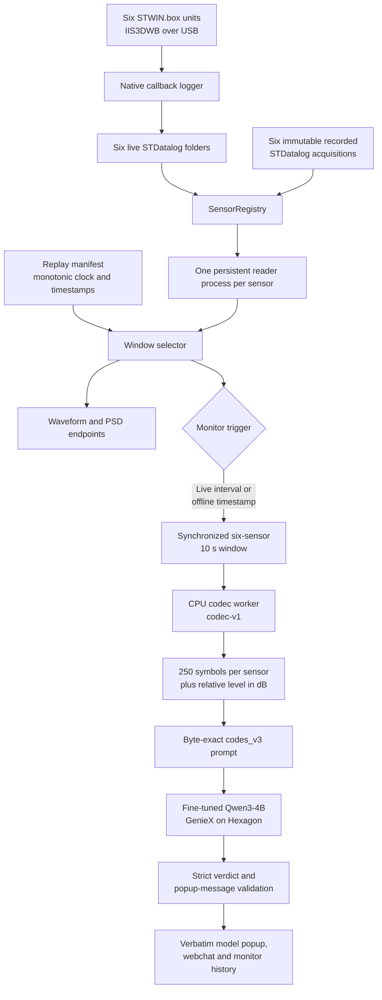

# VibroAgent — on-device building-vibration diagnostics

This repository now offers two complete deployment paths:

- **VibroAgent-Gemma** — the newer continuous vibration encoder + Gemma Q8 path, with live six-board deployment and included LUMO demo windows. Start at [VibroAgent-Gemma/README.md](VibroAgent-Gemma/README.md).
- **VibroAgent-Codec** — the established residual-VQ codec + Qwen3-4B path documented below, with live and immutable recorded-data modes.

Read [DEPLOYMENT_PATHS.md](DEPLOYMENT_PATHS.md) for the technical comparison and copy-paste commands for both paths. They share the same reviewed STDATALOG-PYSDK acquisition patch; stop one live stack before starting the other.

## VibroAgent-Codec

VibroAgent-Codec is an edge monitoring application for a six-sensor building-vibration installation. One STMicroelectronics STWIN.box is the reference sensor and five STWIN.box units are target sensors. The application continuously acquires IIS3DWB acceleration data, compares every target with the reference, and produces a strictly structured monitoring verdict with a fine-tuned Qwen3-4B model running locally on the Hexagon NPU of a Qualcomm IQ-9075 EVK.

The production decision path is the `codes_v3` stack. A frozen residual-vector-quantized neural codec converts each synchronized 10-second sensor window into discrete code symbols. The language model receives those symbols and a relative broadband-level value; raw acceleration samples remain local. The web application presents live waveforms, PSD views, chat, monitoring history, and alert popups.

The complete live and recorded-data stacks target Linux on the Qualcomm IQ-9075. A smaller codec demonstration can run on another Linux computer without sensors or Qualcomm hardware.

## 1. Setup

### 1.1 Requirements

| Requirement | Live installation | Recorded-data installation |
|---|---|---|
| Compute platform | Qualcomm Addons IQ-9075 EVK with Linux, aarch64, and Hexagon HTP access | The same IQ-9075 platform; STWIN.box hardware is not required |
| Sensors | Six STEVAL-STWINBX1 boards: one reference and five targets | None |
| Sensor firmware | FP-SNS-DATALOG2 v3.2.0 | None |
| USB | Powered hub with at least six ports | None |
| Privileges | `sudo` for libusb, udev rules, and the `hsdatalog` group | No USB setup |
| Python | Python 3.10 or newer; environments are created automatically | Python 3.10 or newer; environments are created automatically |
| Storage | At least 8 GB free for environments, SDK files, and model weights | At least 8 GB, plus about 280 MB for the five-minute recording set |
| Network access | GitHub access to this private repository and its release assets, or access to the configured Hugging Face fallback | Same |

The setup scripts install `uv` automatically when it is not already available.

### 1.2 Clone the repository

Using GitHub CLI:

```bash
gh repo clone hobbitlv1/vibroagent-iq9075-codec
cd vibroagent-iq9075-codec
```

Or using Git directly:

```bash
git clone https://github.com/hobbitlv1/vibroagent-iq9075-codec.git
cd vibroagent-iq9075-codec
```

Because the repository and release are private, authenticate before setup:

```bash
gh auth login
gh auth status
```

### 1.3 Choose the data source and install

For the six-board live installation:

```bash
./setup.sh
```

For the complete application with recorded input and no USB boards:

```bash
./setup.sh --offline
```

The selected mode is written to `.vibro_mode`. In live mode, the USB logger owns the runtime folders under `stdatalog_examples/live_*` and starts each acquisition with new output files. In offline mode, no logger or replay writer is started: the web process opens the verified files under `recordings/live_*` read-only and selects fixed windows by timestamp. The supplied `.dat` files are never copied into the live folders, truncated, appended to, or rewritten.

Run `./setup.sh` again to switch to live sensors. Run `./setup.sh --offline` again to switch back to immutable replay. Setup is idempotent: valid environments, pinned SDK sources, verified weights, and verified recordings are reused.

### 1.4 What setup installs

`setup.sh` performs the following current production steps:

1. In live mode, `setup_usb.sh` installs libusb, writes `/etc/udev/rules.d/30-hsdatalog.rules` for ST devices `0483:5743` and `0483:5744`, creates the `hsdatalog` group, and adds the current user.
2. `setup_sdk.sh` fetches the four STDATALOG-PYSDK v1.3.0 repositories at pinned commits and applies the path-preserving `sdk_patches/overlay/`.
3. It creates `./vibroagent-venv` and installs the `vibroagent_mcp` application plus its runtime and test dependencies.
4. It creates `~/codec-cpu-venv` with NumPy, SciPy, and CPU-only PyTorch for deterministic codec inference.
5. `setup_geniex.sh` creates `~/geniex-venv` and installs the Qualcomm GenieX runtime.
6. `setup_models.sh` downloads and verifies the fine-tuned `codes_v3` GGUF.
7. In recorded mode, `setup_recordings.sh` also downloads and verifies the five-minute, six-channel recording set.

The large GGUF is resolved in this order:

1. GitHub release `weights-v1` on the repository configured as `origin`. The model is stored as two release assets because of the release-asset size limit. Each part is verified, the parts are concatenated byte-for-byte, and the final file is verified again.
2. The Hugging Face repository selected by `VIBRO_MODELS_REPO`, which defaults to `hobbitlv/vibroagent-models`. Set `HF_TOKEN` or run `hf auth login` when that fallback is private.

The installed file is:

```text
models/qwen3_4b_codes_v3_Q4_0_embq8.gguf
SHA-256: 3a18c057e47d8032cb771140e54ed7bbfcf8cf1d58c6d990f579800f149a90c2
```

A mismatched model, split part, or recording file fails closed instead of being served.

### 1.5 Complete the live USB setup

When `setup_usb.sh` adds the current account to `hsdatalog`, log out and back in or reboot before connecting the fleet. Confirm the membership with:

```bash
id -nG | tr ' ' '\n' | grep '^hsdatalog$'
```

Connect the powered USB hub and all six STWIN.box units. The launcher verifies that the reference serial is present and that the native HSDatalog interface can open the expected fleet before starting acquisition.

### 1.6 Verify the installation

Verify the application environment and patched ST SDK:

```bash
./vibroagent-venv/bin/python -c \
  "from stdatalog_core.HSD_link.HSDLink import HSDLink; print('STDATALOG import OK')"
```

Verify the frozen codec against the included golden outputs:

```bash
~/codec-cpu-venv/bin/python examples/selftest.py
```

A valid installation ends with:

```text
SELFTEST PASS: byte-identical to the proven live encoder
```

This test covers recorded STDatalog decoding, measured sample-rate handling, rational resampling, normalization, checkpoint loading, residual-VQ extraction, and code-symbol serialization.

## 2. Run VibroAgent

### 2.1 Start the complete stack

```bash
./vibroagent.sh start
```

The command always starts the codes_v3 model service and web application. Live mode also starts the six-board callback logger. Offline mode only validates the manifest and all six recording streams; its replay clock runs inside the web application, so there is no offline data-writer process. The launcher prints the web address after startup.

Common lifecycle commands:

```bash
./vibroagent.sh status
./vibroagent.sh restart
./vibroagent.sh restart-webchat
./vibroagent.sh stop-model
./vibroagent.sh stop
```

Logs and PID files are written under `.run/`:

```bash
tail -f .run/geniex.log
tail -f .run/webchat.log
tail -f .run/logger.log
```

Use `./vibroagent.sh stop` for the live fleet. The launcher sends `SIGINT` to the logger and waits for `stop_log` confirmation from every board. A forced logger termination can leave a board in a state that requires a physical USB replug.

### 2.2 Open the interface

The model API listens only on loopback:

```text
http://127.0.0.1:18181/v1
```

The web application listens on port `7860`. By default, the launcher selects the IPv4 address used by the default route and prints the resulting URL:

```text
http://<iq-9075-lan-ip>:7860
```

The graph page is available at `/graph`. Set `WEB_HOST=127.0.0.1` before launch for local-only access, or `WEB_HOST=0.0.0.0` to bind every interface.

The web application has no authentication. Keep it on a trusted network and do not expose port `7860` directly to the internet.

### 2.3 Recorded-data mode

Recorded mode exercises the same readers, codec worker, prompt builder, codes_v3 endpoint, verdict validation, graphs, history, and popup UI without USB hardware.

```bash
./setup.sh --offline
./vibroagent.sh start
```

`setup_recordings.sh` downloads and hash-verifies `recordings/recordings_manifest.json` plus six complete STDatalog acquisitions:

```text
recordings/
├── recordings_manifest.json
├── live_baseline/iis3dwb_acc.dat
└── live_target_1/ ... live_target_5/iis3dwb_acc.dat
```

The anomaly waveforms are already injected into the target `.dat` streams. Nothing is injected during replay, and the baseline stream is unchanged. A monotonic virtual clock starts with the web process, advances through the five-minute acquisition at `VIBRO_REPLAY_SPEED`, and returns to zero when looping is enabled. Graph and PSD requests use that clock to pass an explicit `start_time_s` to the ordinary STDatalog reader with current-data checks disabled. They therefore display the original samples at the virtual position while the files remain byte-for-byte unchanged.

Inference is event-driven in offline mode:

1. The graph continues to replay fixed waveform and PSD windows between scheduled events; codec and model inference do not run during those intervals.
2. At each supplied timestamp, the monitor claims that event once for the current replay cycle and reads the same exact 10-second window from the baseline and all five targets.
3. The isolated CPU worker runs the frozen codec-v1 checkpoint and emits 250 symbols for each sensor plus target levels relative to the baseline.
4. The trained codes_v3 prompt prefix and bounded popup instruction are sent to the required GenieX model in one request. Its schema-validated response contains both the verdict and the complete operator-facing popup message.
5. If acquisition, codec, or model inference fails, the event claim is released so the next monitor attempt retries it. A deterministic prepass is never shown as a codes_v3 verdict.

The preferred schedule fields are explicit timestamps:

```json
{
  "schema": "vibroagent-offline-recordings-v3",
  "seconds": 300.0,
  "inference_window_s": 10.0,
  "inference_timestamps_s": [45.0, 90.0, 150.0, 210.0]
}
```

The complete manifest also pins every acquisition file by SHA-256 and records per-event provenance. `inference_windows` may be used when individual labels are needed; otherwise `inference_timestamps_s` takes precedence. For compatibility with the supplied set, the controller falls back to the distinct `events[].start_s` values and deduplicates simultaneous events into one six-sensor inference.

The supplied schedule contains these demonstration events:

| Time in cycle | Target | Event | Measured level relative to reference |
|---|---|---|---:|
| 45–55 s | `target_2` | Repeated impulses | +13.4 dB |
| 90–100 s | `target_4` | Tone with harmonics | +13.1 dB |
| 150–160 s | `target_1` | Broadband increase | +13.4 dB |
| 210–220 s | `target_3` | Repeated impulses | +9.5 dB |
| 210–220 s | `target_5` | Mild tone | +5.3 dB |

With `/graph` open and Agent monitoring enabled, the page schedules a one-shot monitor wake-up for the next replay timestamp, independent of the normal 30-second live polling interval. The virtual timestamp and the decoded model window are exact; wall-clock execution can begin slightly later if a chat is already using the single NPU, in which case the event remains pending and is retried.

### 2.4 Codec demonstration on another Linux computer

The files under `examples/` exercise the production codec and prompt code without ST hardware or the ST SDK.

```bash
uv venv .codec-demo-venv
source .codec-demo-venv/bin/activate
uv pip install numpy scipy
uv pip install torch --index-url https://download.pytorch.org/whl/cpu

python examples/selftest.py
python examples/run_example.py --dry-run
```

The dry run prints the discrete codes, relative levels, and exact model prompt without calling an LLM.

For a full verdict on a non-Qualcomm machine, serve the downloaded GGUF with an OpenAI-compatible llama.cpp server:

```bash
./setup_models.sh
llama-server \
  -m models/qwen3_4b_codes_v3_Q4_0_embq8.gguf \
  -c 6144 \
  --port 8080

python examples/run_example.py --endpoint http://127.0.0.1:8080/v1
```

Use `--offset-s` to select another 10-second region and `--axis x|y|z` to select one accelerometer axis.

## 3. Architecture

### 3.1 System overview



The architecture separates acquisition, window selection, signal representation, language-model inference, and presentation. Live mode resolves the mutable `stdatalog_examples/live_*` folders and analyzes the latest synchronized window. Offline mode remaps the same six logical sensor IDs to immutable `recordings/live_*` folders, then supplies an explicit virtual `start_time_s`. Both modes use the same calibrated decoder and the same codec-v1 → codes_v3 decision path.

Waveform and PSD rendering branches before inference. In offline mode those endpoints advance continuously with the replay clock, but the expensive codec and NPU path is entered only at a manifest timestamp. The model writes the complete popup body inside the same structured verdict response. The web server validates and displays that body verbatim; the graph renderer and deterministic signal features do not compose or rewrite it.

### 3.2 Long-running services

| Service | Endpoint | Process | Responsibility |
|---|---|---|---|
| Model service | `127.0.0.1:18181` | `vibroagent_mcp.geniex_openai_server` | Loads the hash-pinned GGUF through GenieX, places computation on `HTP0,HTP1`, enforces the context limit, and exposes an OpenAI-compatible API |
| Web application | `<LAN IP>:7860` | `vibroagent_mcp.webchat_server` | Serves the UI and REST endpoints, coordinates sensor reads, invokes the codec worker, builds the prompt, requests a verdict, validates it, and records monitor history |
| Live data producer | No network port | `vibroagent_two_vibrometer_logger.py` | Owns the six USB boards and populates one mutable STDatalog acquisition folder per logical sensor |
| Offline replay controller | No separate process | Runs inside the web application | Maps logical sensors to immutable recordings, advances the virtual clock, and claims each inference timestamp once per cycle |

The web process also owns one long-running reader child process for each sensor. These children are not independent services exposed to the network.

### 3.3 Acquisition and sensor identity

The live producer is `stdatalog_examples/vibroagent_two_vibrometer_logger.py`. It opens the ST native HSDatalog v2 interface and registers a data-ready callback for each IIS3DWB component. The native callback writes received blocks directly to the correct `iis3dwb_acc.dat` file; decoding is kept out of the USB callback path.

Physical board serial numbers map to the logical IDs `baseline` and `target_1` through `target_5` in the logger's `DEFAULT_ROLES` table. Logical IDs, locations, acquisition folders, sensor component names, and default axes are registered in `vibrodiag_mcp_prototype/config/sensors.live.yaml`. Both mappings must describe the same installation.

Each live folder contains STDatalog metadata and a continuously growing data stream:

```text
stdatalog_examples/
├── live_baseline/
└── live_target_1/ ... live_target_5/
    ├── acquisition_info.json
    ├── device_config.json
    └── iis3dwb_acc.dat
```

The web layer accepts only folders resolved through `SensorRegistry` and constrained beneath `VIBRO_ALLOWED_HSD_DIR`. The model cannot select an arbitrary filesystem path or reassign a physical board.

### 3.4 Why each board has its own reader process

STDATALOG-PYSDK maintains mutable decoder and native state inside the Python process. Concurrent reads from multiple acquisition folders in a single interpreter can serialize, interfere with one another, or corrupt the effective live-read state.

`board_reader_process.py` therefore starts one persistent spawned process for every `(acquisition folder, component)` pair. Each process owns:

- one SDK decoder;
- one bounded request queue and one response queue;
- its own interpreter and native state;
- a rolling live buffer;
- timeout, startup-grace, liveness, and restart handling.

The web server issues reads concurrently while the process boundary preserves SDK isolation. Reader processes are pre-warmed after the logger starts so the first all-sensor monitor request does not pay six cold-open costs.

### 3.5 The codec-v1 representation

For every monitoring pass, the web server requests 10.5 seconds from each reader. The additional margin ensures that the codec worker can take a complete most-recent 10-second window after timestamp and frame-boundary handling.

For each sensor, `live_codes_worker.py` performs this deterministic chain:

1. Select the configured single axis, normally `z`.
2. Retain the latest 10 seconds at that sensor's measured native sample rate.
3. Remove the native-window DC mean.
4. Resample to exactly 400 Hz with a reduced rational `resample_poly` ratio.
5. Keep exactly 4,000 samples.
6. Detrend and normalize the waveform to unit AC RMS.
7. Preserve the pre-normalization AC level as `level_db`.
8. Load the frozen codec-v1 architecture from `codec_runtime.py` and encode with the pinned checkpoint.
9. Serialize the residual-VQ indices with the pinned code-token map.

The codec is a convolutional residual-VQ autoencoder. One 4,000-sample window produces 125 latent frames. Each frame is quantized by two codebooks with 1,024 entries per codebook, producing 250 symbols per sensor. Every symbol in `r1_token_map.json` was selected to be exactly one token for the Qwen tokenizer.

Normalization deliberately separates waveform shape from absolute energy. The codec represents shape; each target's broadband energy is carried separately as:

```text
level_rel_db = level_db(target) - level_db(reference)
```

This prevents amplitude from being lost during normalization while keeping the prompt compact.

### 3.6 Prompt and model inference

`vibroagent_mcp.live_codes` loads `assets/codes_v3_prompt_template.json` and reconstructs the byte-level prompt used for fine-tuning. The production monitor preserves that trained prefix and extends its final instruction and response schema with one bounded `popup_message` field. A six-sensor request contains:

- the 250-symbol reference sequence;
- one 250-symbol sequence for each of five targets;
- one `level_rel_db` value per target;
- the fixed interpretation instructions;
- the required JSON response shape.
- an instruction for a complete, concise operator message written entirely by the model in the same response.

The trained base prompt is not regenerated from a drifting training script. Golden tests bind that base to the immutable training format and reject changes in ordering, whitespace, or symbol count; separate tests bind the small production popup extension and its schema.

The model is `qwen3_4b_codes_v3_Q4_0_embq8.gguf`, based on Qwen3-4B-Instruct-2507 and fine-tuned for the `codes_v3` representation. GenieX loads the Q4_0 GGUF directly through its llama.cpp Hexagon backend. The production configuration uses two Hexagon sessions, `llama_cpp:HTP0,HTP1`, and a 6,144-token context.

The web application requests one greedy, schema-constrained inference for the verdict and popup message together. The GenieX adapter compiles the response schema into a grammar and rejects prompts that would exceed the configured context instead of silently truncating them.

### 3.7 Verdict validation

The accepted sensor labels are:

```text
normal_relative_to_baseline
mild_deviation
significant_local_deviation
sensor_data_quality_issue
```

The accepted network labels are:

```text
normal_relative_to_reference_sensor
mild_local_deviation
localized_vibration_deviation
mild_multi_sensor_deviation
multi_sensor_building_wide_vibration_event
```

The response must contain every requested target exactly once, use only the fixed labels, provide only known target IDs in `affected_sensor_ids`, include `popup_message`, and contain no unexpected top-level keys. The message is limited to 60 words and 480 characters, must name exactly the affected target IDs, must not expose implementation names, and must not make a certified structural-safety claim. Invalid JSON, missing fields or sensors, unknown labels, invalid message text, timeouts, stale data, failed reads, codec errors, and hash mismatches are surfaced as failures. They are not silently converted into a successful model verdict.

After validation, the popup body is the model's string with only surrounding whitespace removed. The server does not prepend a diagnosis, append history, or paraphrase it. The fixed popup title and separate status, affected-sensor, history, and confidence metadata remain deterministic UI fields.

Deterministic checks remain authoritative for missing, stale, flat, or otherwise invalid sensor data. They protect the data path and constrain what reaches inference; they do not invent a replacement language-model decision.

### 3.8 Waveform and PSD path

The waveform and PSD views branch from the calibrated reader output before codec inference. They provide operator context but are not the production model input. Display filters and PSD settings do not modify the stored acquisition streams or the codec window.

The graph interface supports time-domain inspection, periodic-Hann Welch PSD, optional analysis filters, dominant-peak markers, and pointer-based frequency and density readout.

### 3.9 Data and trust boundaries

Raw acceleration arrays remain on the IQ-9075. The codec worker receives them through a temporary local `.npz` file, writes a local JSON payload containing codes and levels, and the web server removes the temporary directory after the worker returns.

Only discrete symbols, relative level values, fixed instructions, and the expected response schema reach the model server. The model server is loopback-only. The LAN-facing web application is the only externally reachable service in the default configuration.

## 4. Hardware and signal contract

| Property | Production value |
|---|---|
| Board | Qualcomm Addons IQ-9075 EVK, QCS9075 SoC, Linux aarch64 |
| Sensors | Six STEVAL-STWINBX1 units |
| Accelerometer | IIS3DWB three-axis wide-bandwidth MEMS |
| Acquisition rate | Nominal 26.667 kHz; the measured per-unit rate is carried through each read |
| Range and encoding | ±16 g, 0.488 mg/LSB, signed 16-bit samples |
| STDatalog framing | 1,000 samples per timestamp, three axes, eight-byte timestamp |
| Comparison topology | One reference plus five targets |
| Analysis window | Latest synchronized 10 seconds live; exact scheduled 10-second window offline |
| Production axis | `z`, unless a single-axis sweep is explicitly requested |
| Codec rate | 400 Hz |
| Codec input | 4,000 samples per sensor |
| Codec output | 250 single-token symbols per sensor |
| Model | Fine-tuned Qwen3-4B, Q4_0 GGUF with q8_0 embeddings |
| Inference device | Hexagon HTP through GenieX |

All compared sensors should use the same firmware, range, component configuration, mounting convention, and axis orientation. The model is trained for single-axis signals; a vector magnitude is not a valid substitute.

## 5. Configuration

### 5.1 Sensor configuration

Before deploying a different physical fleet:

1. Update the serial-to-role entries in `DEFAULT_ROLES` inside `stdatalog_examples/vibroagent_two_vibrometer_logger.py`.
2. Update locations, folders, sensor component names, and axes in `vibrodiag_mcp_prototype/config/sensors.live.yaml`.
3. Keep the required logical IDs: `baseline` and `target_1` through `target_5`.
4. Run the native probe and codec self-test before trusting monitoring output.

The baseline serial is also checked by `vibroagent.sh` before acquisition begins.

### 5.2 Current runtime overrides

| Variable | Default | Purpose |
|---|---|---|
| `CODES_GGUF` | `models/qwen3_4b_codes_v3_Q4_0_embq8.gguf` | Fine-tuned model path |
| `CODES_GGUF_SHA256` | Pinned production hash | Expected model digest |
| `GENIEX_PORT` | `18181` | Loopback model port |
| `GENIEX_DEVICE_MAP` | `llama_cpp:HTP0,HTP1` | GenieX compute placement |
| `GGML_HEXAGON_NDEV` | `2` | Number of Hexagon sessions |
| `GENIEX_N_CTX` | `6144` | Model context length |
| `GENIEX_PYTHON` | `~/geniex-venv/bin/python` | GenieX environment |
| `VIBRO_CODES_WORKER_PYTHON` | `~/codec-cpu-venv/bin/python` | Codec environment |
| `VIBRO_CODES_WORKER_TIMEOUT_S` | `90` | Codec subprocess timeout |
| `AGENT_MONITOR_MODEL_TIMEOUT_S` | `60` | Timeout for each required codes_v3 monitor verdict |
| `AGENT_MONITOR_MAX_TOKENS` | `256` | Bounded output budget for the verdict and complete popup message |
| `VIBRO_CODES_AXES` | Unset | Optional comma-separated single-axis passes, such as `x,y,z` |
| `WEB_HOST` | Default-route IPv4 address | Web bind address |
| `WEB_PORT` | `7860` | Web application port |
| `EXPECTED_BOARDS` | `6` | Native probe fleet size |
| `VIBRO_BOARD_READER_PROCESSES` | Enabled by live UI requests | Override per-board process readers |
| `VIBRO_BOARD_READER_TIMEOUT_S` | `30` | Normal read timeout |
| `VIBRO_BOARD_READER_START_METHOD` | `spawn` | Multiprocessing start method |
| `VIBRO_REPLAY_SOURCE_ROOT` | `recordings` | Root containing the immutable offline acquisitions |
| `VIBRO_REPLAY_MANIFEST` | `<replay root>/recordings_manifest.json` | Hash and inference schedule metadata |
| `VIBRO_REPLAY_SPEED` | `1` | Virtual playback speed multiplier |
| `VIBRO_REPLAY_LOOP` | `1` | Repeat the recording and inference schedule after the final timestamp |
| `VIBRO_ACQUISITION_ROOT` | Set by the launcher in offline mode | Internal SensorRegistry remap from live logical folders to the replay root |

Asset-source overrides are `VIBRO_GH_REPO`, `VIBRO_RELEASE_TAG`, `VIBRO_MODELS_REPO`, `GITHUB_TOKEN`, and `HF_TOKEN`.

## 6. Repository structure

```text
vibroagent-iq9075-codec/
├── setup.sh                         Complete live or recorded-data installation
├── setup_usb.sh                     libusb, udev rules, and hsdatalog group
├── setup_sdk.sh                     Pinned STDATALOG-PYSDK plus local overlay
├── setup_geniex.sh                  Dedicated GenieX environment
├── setup_models.sh                  Hash-verified codes_v3 GGUF download
├── setup_recordings.sh              Hash-verified immutable replay set
├── vibroagent.sh                    Current service lifecycle entry point
├── recordings/                      Downloaded release assets; ignored by Git
│   ├── recordings_manifest.json     Hashes, event provenance, and timestamps
│   └── live_baseline/ ... _5/       Six immutable STDatalog acquisitions
├── models/
│   ├── codec_v1/best.pt             Frozen codec checkpoint
│   ├── codec_v1/split_manifest.json Codec provenance gate
│   ├── release_assets_manifest.json Release filenames, sizes, and SHA-256 pins
│   └── README.md                    Model identities and integrity pins
├── examples/
│   ├── live_baseline/               Included 60-second reference recording
│   ├── live_target_1/ ... _5/       Included 60-second target recordings
│   ├── golden_codes.json            Expected byte-exact codec output
│   ├── stdatalog_reader.py          NumPy-only STDatalog reader
│   ├── selftest.py                  Frozen-chain verification
│   └── run_example.py               Recorded data to prompt or full verdict
├── sdk_patches/
│   ├── overlay/                     Files applied over stock SDK v1.3.0
│   └── README.md                    Patch rationale and provenance
├── stdatalog_examples/
│   ├── live_baseline/               Mutable live reference output
│   ├── live_target_1/ ... _5/       Mutable live target outputs
│   ├── vibroagent_two_vibrometer_logger.py
│   └── vibroagent_hsd_native_probe.py
└── vibrodiag_mcp_prototype/
    ├── config/sensors.live.yaml      Logical sensor registry
    ├── data/codec_pretrain/r1_token_map.json
    ├── scripts/codec_runtime.py     Frozen codec-v1 architecture
    ├── scripts/live_codes_worker.py CPU codec entry point
    ├── scripts/repr_extractor.py    Checkpoint and code-map loader
    ├── scripts/serve_codes_v3_geniex.sh
    ├── src/vibroagent_mcp/
    │   ├── webchat_server.py        UI, REST API, and monitor coordinator
    │   ├── board_reader_process.py  Isolated persistent SDK readers
    │   ├── sdk_vibrometer.py        Calibrated live-window extraction
    │   ├── sensor_registry.py       Registered sensor resolution
    │   ├── live_codes.py            Prompt builder and verdict validator
    │   ├── offline_replay.py        Immutable clock and inference schedule
    │   └── geniex_openai_server.py  GenieX OpenAI-compatible adapter
    └── tests/                        Hardware-independent regression suite
```

## 7. Verification and tests

Run the codec reproducibility gate:

```bash
~/codec-cpu-venv/bin/python examples/selftest.py
```

Run the application test suite:

```bash
cd vibrodiag_mcp_prototype
../vibroagent-venv/bin/python -m pytest tests/
```

The test suite uses mock sensors and recorded signals; it does not require connected boards. It covers live readers, process isolation, codec prompt construction, schema validation, model adapters, web APIs, monitor history, graphs, and failure behavior.

The principal integrity gates are:

| Artifact | Gate |
|---|---|
| STDATALOG SDK | Four pinned upstream commit IDs plus the reviewed `sdk_patches` overlay |
| Codec checkpoint | SHA-256 `a80216b639327f9b4e59447138abc025fddac2d6d5eca68448c4ac14c653a350` |
| Codec behavior | Byte-exact comparison against `examples/golden_codes.json` |
| Token map | Hash recorded in codec output provenance |
| Prompt format | Byte-constant template and regression tests |
| Fine-tuned GGUF | Final SHA-256 checked before service startup |
| Recorded-data set | Per-file SHA-256 values in `recordings_manifest.json` |
| Model output | Grammar constraint plus strict post-parse validation |

## 8. Board-measured performance

| Stage | Measured result |
|---|---|
| Six-window codec encode on CPU | A few seconds |
| GenieX prefill on Hexagon | Approximately 342–422 tokens/s |
| GenieX decode on Hexagon | Approximately 6–11 tokens/s |
| Six-sensor verdict with about a 1.9K-token prompt | Under 30 seconds end to end |
| Acquisition fleet | Six units at approximately 26.7 kHz × three axes over USB |

These measurements describe the IQ-9075 production configuration and should not be treated as guarantees for another firmware, thermal state, device map, context length, or model file.

## 9. Scope and limitations

- VibroAgent reports relative deviations against a reference sensor. It does not identify a structural damage mechanism or certify structural safety.
- The output is monitoring and triage information for an operator, not a substitute for engineering inspection.
- The current model contract is single-axis. Production uses `z`; vector magnitude is outside the training distribution.
- Codec training used public vibration corpora. The monitored building and the recordings in this repository were not codec training data.
- The recorded five-minute demonstration includes staged events in target channels so alert behavior can be exercised. The reference channel remains unchanged.
- Model weights and the extended recordings are downloaded during setup and require access to one configured asset source.
- The LAN-facing web application has no authentication.
- A failed sensor read, stale stream, codec failure, invalid model response, or model timeout is reported as a failure rather than hidden behind a normal verdict.

## 10. Ownership and license

This project is licensed under CC BY-NC-SA 4.0. See [`LICENSE.md`](LICENSE.md) for the complete terms and ownership statement.

Owners:

- Niks KORDJUKOVS, System Research and Applications
- Danilo Pau, System Research and Applications, danilo.pau@st.com
- STMicroelectronics SRL

Third-party components retain their own licenses. The SDK overlay is BSD-3-Clause © STMicroelectronics and is documented in `sdk_patches/LICENSE.md`. The fetched STDATALOG-PYSDK repositories carry their upstream licenses. The Qwen3-4B-Instruct-2507 base model is Apache-2.0.
