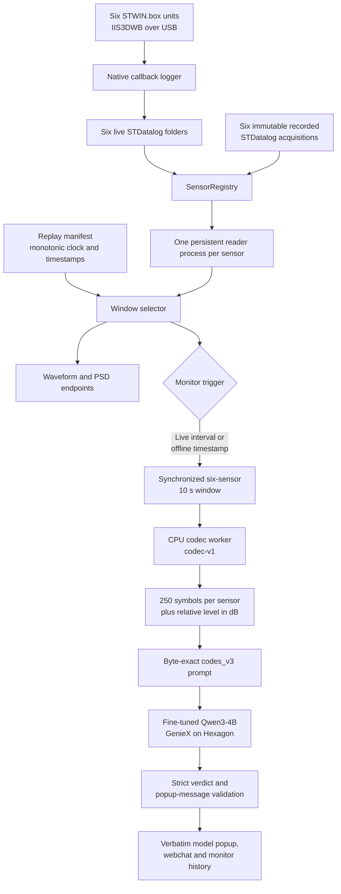
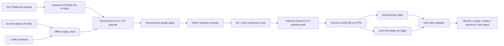

# VibroAgent — on-device building-vibration diagnostics

This repository is the complete, reversible distribution for two independently deployable VibroAgent implementations:

- **VibroAgent-Codec** is the established residual-vector-quantized codec and Qwen3-4B deployment. It supports six live STWIN.box boards, immutable five-minute replay, and a portable codec-only demonstration.
- **VibroAgent-Gemma** is the continuous encoder and Gemma 4 E2B Q8 deployment. It supports the same six-board live installation, a board-free 60-second web replay with scheduled LUMO events, and direct LUMO command-line inference.

Both implementations keep vibration processing local to the IQ-9075. They live in separate directories, use separate environments and launchers, and can be installed or removed without overwriting the other. They share the reviewed STDATALOG-PYSDK acquisition overlay; only one live stack should own the six USB boards at a time.

## One installer, five deployment choices

Run the root installer from a real terminal:

```bash
./install.sh
```

```text
       ██  ██ ██ █████  █████   ████   ████   █████ █████ ███  ██ ██████
       ██  ██ ██ ██  ██ ██  ██ ██  ██ ██  ██ ██     ██    ████ ██   ██
       ██  ██ ██ █████  █████  ██  ██ ██████ ██ ███ ████  ██ ████   ██
        ████  ██ ██  ██ ██ ██  ██  ██ ██  ██ ██  ██ ██    ██  ███   ██
         ██   ██ █████  ██  ██  ████  ██  ██  █████ █████ ██   ██   ██
                        STMicroelectronics  &  Qualcomm
       ▃▃▄▄▄▄▄▃▃▂▁▁▁▁▁▂▃▃▄▄▄▄▄▃▃▂▁▁▁▁▁▂▃▃▄▄▄▄▄▃▃▂▁▁▁▁▁▂▃▃▄▄▄▄▄▃▃▂▁▁▁▁▁▂▃
                      STWIN.BOX // IQ-9075 // HEXAGON HTP

  Choose a deployment
  VibroAgent-Codec  RVQ codec tokens · Qwen3-4B
  ▸ 1  Live six-board deployment
    2  Offline five-minute replay
  VibroAgent-Gemma  continuous encoder · Gemma 4 E2B Q8
    3  Live six-board deployment
    4  Offline LUMO web pipeline
    5  Direct LUMO CLI demo
    q  Exit installer

  Discrete codec tokens + Qwen3-4B. Requires six STWIN.box boards.
  Enter runs  ./setup.sh
  Up/Down or j/k move  ·  1-5 jump  ·  Enter select  ·  q quit

                          Danilo Pau & Niks Kordjukovs
            System Research and Applications  ·  STMicroelectronics
```

Use Up/Down, press Enter, and follow the printed run command. Setup is kept separate from startup because a first live USB installation may require a new login or reboot before group membership and udev rules take effect.

For provisioning, CI, SSH sessions without a terminal, or exact copy-paste use, pass one selection flag:

| Selection | Setup performed | Command printed after setup |
|---|---|---|
| `./install.sh --codec-live` | Codec live environment, SDK, USB, GenieX, and weights | `./vibroagent.sh start` |
| `./install.sh --codec-offline` | Codec immutable recordings and full web environment | `./vibroagent.sh start` |
| `./install.sh --gemma-live` | Gemma live environment, patched GenieX, encoder, and Q8 weights | `./VibroAgent-Gemma/vibroagent.sh start` |
| `./install.sh --gemma-offline` | Gemma web environment and bundled 60-second `.dat` replay | `./VibroAgent-Gemma/vibroagent.sh start` |
| `./install.sh --gemma-demo` | Gemma encoder/model path and compact LUMO fixtures | `./VibroAgent-Gemma/vibroagent.sh demo target_3` |

Useful installer controls:

```bash
# Show commands without installing anything.
./install.sh --gemma-offline --dry-run

# Skip the splash in logs.
./install.sh --codec-live --no-splash

# Disable ANSI colors.
NO_COLOR=1 ./install.sh --gemma-demo

# Preview the installer without changing the machine.
./install.sh --preview-animation

# Use the plain-ASCII fallback or stream raw setup output.
./install.sh --preview-animation --ascii
./install.sh --gemma-live --no-animation

# Show all options.
./install.sh --help
```

Animated installation rows explicitly reset their cursor column, so they do not depend on the terminal's newline-translation setting. The progress bar shrinks to fit the actual terminal width; below 24 columns, installation uses plain scrolling output instead of a two-row animation.

The installer accepts exactly one deployment selection. Re-running a selection is safe: the underlying setup scripts verify and reuse valid repositories, environments, recordings, and model artifacts.

## Choose the implementation

| Property | VibroAgent-Codec | VibroAgent-Gemma |
|---|---|---|
| Primary purpose | Stable discrete-token deployment | New continuous-embedding research deployment |
| Input per board | One configured axis | Synchronized X, Y, and Z |
| Analysis window | 10 seconds | 10 seconds |
| Sensor topology | One reference + five targets | One reference + five targets |
| Representation | Residual VQ codes at 400 Hz | 14 continuous rows per board, 84 rows total |
| Language model | Qwen3-4B, Q4_0 embeddings/Q8 KV | Gemma 4 E2B, Q8_0 |
| How vibration enters | Code symbols in a text prompt | Projected embeddings inside the model sequence |
| Context | 6,144 | 4,096 |
| HTP placement | HTP0 + HTP1 | HTP0 |
| Runtime | Packaged GenieX path | GenieX v0.4.0 plus included stateful embedding/logit bridge patches |
| Output contract | Grammar-constrained JSON | Global binary state plus joint five-target set logits, validated as JSON |
| Operational classes | Legacy fine-grained set | `normal`, `unknown_anomaly`, deterministic `data_invalid` |
| Localization | Model verdict under Codec contract | Five simultaneous target decisions; source-zone labels, not largest-response labels |
| Offline experience | Five-minute immutable recording replay | 60-second full web replay with scheduled LUMO target events |
| Model artifact | About 2.46 GB | 4.95 GB (4.61 GiB) Q8 GGUF |
| Maturity | Established path | Research checkpoint; promotion gate is not yet met |

Use Codec when you need the established deployment and its older label vocabulary. Use Gemma when evaluating continuous vibration tokens, five-target localization, LUMO replay, or the current encoder/checkpoint pair. Neither path is a certified structural-safety system.

The rest of this document is self-contained. [DEPLOYMENT_PATHS.md](DEPLOYMENT_PATHS.md) remains a compact command reference, while each deployment directory also keeps focused operator notes.

## VibroAgent-Codec

VibroAgent-Codec is an edge monitoring application for a six-sensor building-vibration installation. One STMicroelectronics STWIN.box is the reference sensor and five STWIN.box units are target sensors. The application continuously acquires IIS3DWB acceleration data, compares every target with the reference, and produces a strictly structured monitoring verdict with a fine-tuned Qwen3-4B model running locally on the Hexagon NPU of a Qualcomm IQ-9075 EVK.

The production decision path is the `codes_v3` stack. A frozen residual-vector-quantized neural codec converts each synchronized 10-second sensor window into discrete code symbols. The language model receives those symbols and a relative broadband-level value; raw acceleration samples remain local. The web application presents live waveforms, PSD views, chat, monitoring history, and alert popups.

The complete live and recorded-data stacks target Linux on the Qualcomm IQ-9075. A smaller codec demonstration can run on another Linux computer without sensors or Qualcomm hardware.

## 1. Setup

### 1.1 Requirements

| Requirement | Live installation | Recorded-data installation |
|---|---|---|
| Compute platform | Qualcomm Addons IQ-9075 EVK with Linux, aarch64, and Hexagon HTP access | The same IQ-9075 platform; STWIN.box hardware is not required |
| Sensors | Six STEVAL-STWINBX1 boards: one reference and five targets | None |
| Sensor firmware | FP-SNS-DATALOG2 v3.2.0 | None |
| USB | Powered hub with at least six ports | None |
| Privileges | `sudo` for libusb, udev rules, and the `hsdatalog` group | No USB setup |
| Python | Python 3.10 or newer; environments are created automatically | Python 3.10 or newer; environments are created automatically |
| Storage | At least 8 GB free for environments, SDK files, and model weights | At least 8 GB, plus about 280 MB for the five-minute recording set |
| Network access | GitHub access to this source repository and its combined weight release, or access to the configured Hugging Face fallback | Same |

The setup scripts install `uv` automatically when it is not already available.

### 1.2 Clone the repository

Using GitHub CLI:

```bash
gh repo clone hobbitlv1/vibroagent-iq9075-combined
cd vibroagent-iq9075-combined
```

Or using Git directly:

```bash
git clone https://github.com/hobbitlv1/vibroagent-iq9075-combined.git
cd vibroagent-iq9075-combined
```

If the source repository or weight release is private, authenticate before setup:

```bash
gh auth login
gh auth status
```

### 1.3 Choose the data source and install

For the six-board live installation:

```bash
./setup.sh
```

For the complete application with recorded input and no USB boards:

```bash
./setup.sh --offline
```

The selected mode is written to `.vibro_mode`. In live mode, the USB logger owns the runtime folders under `stdatalog_examples/live_*` and starts each acquisition with new output files. In offline mode, no logger or replay writer is started: the web process opens the verified files under `recordings/live_*` read-only and selects fixed windows by timestamp. The supplied `.dat` files are never copied into the live folders, truncated, appended to, or rewritten.

Run `./setup.sh` again to switch to live sensors. Run `./setup.sh --offline` again to switch back to immutable replay. Setup is idempotent: valid environments, pinned SDK sources, verified weights, and verified recordings are reused.

### 1.4 What setup installs

`setup.sh` performs the following current production steps:

1. In live mode, `setup_usb.sh` installs libusb, writes `/etc/udev/rules.d/30-hsdatalog.rules` for ST devices `0483:5743` and `0483:5744`, creates the `hsdatalog` group, and adds the current user.
2. `setup_sdk.sh` fetches the four STDATALOG-PYSDK v1.3.0 repositories at pinned commits and applies the path-preserving `sdk_patches/overlay/`.
3. It creates `./vibroagent-venv` and installs the `vibroagent_mcp` application plus its runtime and test dependencies.
4. It creates `~/codec-cpu-venv` with NumPy, SciPy, and CPU-only PyTorch for deterministic codec inference.
5. `setup_geniex.sh` creates `~/geniex-venv` and installs the Qualcomm GenieX runtime.
6. `setup_models.sh` downloads and verifies the fine-tuned `codes_v3` GGUF.
7. In recorded mode, `setup_recordings.sh` also downloads and verifies the five-minute, six-channel recording set.

The large GGUF is resolved in this order:

1. GitHub release `weights-v1` on the combined repository. The model is stored as two release assets because of the release-asset size limit. Each part is verified, the parts are concatenated byte-for-byte, and the final file is verified again.
2. The Hugging Face repository selected by `VIBRO_MODELS_REPO`, which defaults to `hobbitlv/vibroagent-models`. Set `HF_TOKEN` or run `hf auth login` when that fallback is private.

The installed file is:

```text
models/qwen3_4b_codes_v3_Q4_0_embq8.gguf
SHA-256: 3a18c057e47d8032cb771140e54ed7bbfcf8cf1d58c6d990f579800f149a90c2
```

A mismatched model, split part, or recording file fails closed instead of being served.

### 1.5 Complete the live USB setup

When `setup_usb.sh` adds the current account to `hsdatalog`, log out and back in or reboot before connecting the fleet. Confirm the membership with:

```bash
id -nG | tr ' ' '\n' | grep '^hsdatalog$'
```

Connect the powered USB hub and all six STWIN.box units. The launcher verifies that the reference serial is present and that the native HSDatalog interface can open the expected fleet before starting acquisition.

### 1.6 Verify the installation

Verify the application environment and patched ST SDK:

```bash
./vibroagent-venv/bin/python -c \
  "from stdatalog_core.HSD_link.HSDLink import HSDLink; print('STDATALOG import OK')"
```

Verify the frozen codec against the included golden outputs:

```bash
~/codec-cpu-venv/bin/python examples/selftest.py
```

A valid installation ends with:

```text
SELFTEST PASS: byte-identical to the proven live encoder
```

This test covers recorded STDatalog decoding, measured sample-rate handling, rational resampling, normalization, checkpoint loading, residual-VQ extraction, and code-symbol serialization.

## 2. Run VibroAgent

### 2.1 Start the complete stack

```bash
./vibroagent.sh start
```

The command always starts the codes_v3 model service and web application. Live mode also starts the six-board callback logger. Offline mode only validates the manifest and all six recording streams; its replay clock runs inside the web application, so there is no offline data-writer process. The launcher prints the web address after startup.

Common lifecycle commands:

```bash
./vibroagent.sh status
./vibroagent.sh restart
./vibroagent.sh restart-webchat
./vibroagent.sh stop-model
./vibroagent.sh stop
```

Logs and PID files are written under `.run/`:

```bash
tail -f .run/geniex.log
tail -f .run/webchat.log
tail -f .run/logger.log
```

Keep using `./vibroagent.sh stop` and `./vibroagent.sh restart`: safe shutdown is their default implementation, not a separate command or opt-in flag. Both use the same shutdown path, which sends one `SIGINT` to the logger and requires native `stop_log` acknowledgements before stopping the web application and model. `restart` starts the pipeline again only after shutdown succeeds. A timeout leaves the logger alive and blocks restart; neither command escalates to a forced kill or USB reset. The stop helper uses the system Python, so it remains available even when the application virtualenv is missing.

Both live and offline logger startup validate retained shutdown evidence before probing hardware or replacing logs. A pending stop or failed native acknowledgement blocks `start` as well as `restart`, even if `logger.pid` is missing. The saved stop request and shutdown receipt remain authoritative; deleting a PID file is not a recovery procedure. A complete matching receipt permits the next startup without sending another signal.

To stop both independently scoped stacks in this combined checkout, use `bash linux_setup/vibroagent-safe-stop.sh`. The desktop **Stop VibroAgent Safely** shortcut uses this wrapper. It acquires both control locks before stopping either stack and aborts on an incomplete stop. Preview the exact process targets without stopping anything:

```bash
bash linux_setup/vibroagent-safe-stop.sh --dry-run
```

### 2.2 Open the interface

The model API listens only on loopback:

```text
http://127.0.0.1:18181/v1
```

The web application listens on port `7860`. By default, the launcher selects the IPv4 address used by the default route and prints the resulting URL:

```text
http://<iq-9075-lan-ip>:7860
```

The graph page is available at `/graph`. Set `WEB_HOST=127.0.0.1` before launch for local-only access, or `WEB_HOST=0.0.0.0` to bind every interface.

The web application has no authentication. Keep it on a trusted network and do not expose port `7860` directly to the internet.

### 2.3 Recorded-data mode

Recorded mode exercises the same readers, codec worker, prompt builder, codes_v3 endpoint, verdict validation, graphs, history, and popup UI without USB hardware.

```bash
./setup.sh --offline
./vibroagent.sh start
```

`setup_recordings.sh` downloads and hash-verifies `recordings/recordings_manifest.json` plus six complete STDatalog acquisitions:

```text
recordings/
├── recordings_manifest.json
├── live_baseline/iis3dwb_acc.dat
└── live_target_1/ ... live_target_5/iis3dwb_acc.dat
```

The anomaly waveforms are already injected into the target `.dat` streams. Nothing is injected during replay, and the baseline stream is unchanged. A monotonic virtual clock starts with the web process, advances through the five-minute acquisition at `VIBRO_REPLAY_SPEED`, and returns to zero when looping is enabled. Graph and PSD requests use that clock to pass an explicit `start_time_s` to the ordinary STDatalog reader with current-data checks disabled. They therefore display the original samples at the virtual position while the files remain byte-for-byte unchanged.

Inference is event-driven in offline mode:

1. The graph continues to replay fixed waveform and PSD windows between scheduled events; codec and model inference do not run during those intervals.
2. At each supplied timestamp, the monitor claims that event once for the current replay cycle and reads the same exact 10-second window from the baseline and all five targets.
3. The isolated CPU worker runs the frozen codec-v1 checkpoint and emits 250 symbols for each sensor plus target levels relative to the baseline.
4. The trained codes_v3 prompt prefix and bounded popup instruction are sent to the required GenieX model in one request. Its schema-validated response contains both the verdict and the complete operator-facing popup message.
5. If acquisition, codec, or model inference fails, the event claim is released so the next monitor attempt retries it. A deterministic prepass is never shown as a codes_v3 verdict.

The preferred schedule fields are explicit timestamps:

```json
{
  "schema": "vibroagent-offline-recordings-v3",
  "seconds": 300.0,
  "inference_window_s": 10.0,
  "inference_timestamps_s": [45.0, 90.0, 150.0, 210.0]
}
```

The complete manifest also pins every acquisition file by SHA-256 and records per-event provenance. `inference_windows` may be used when individual labels are needed; otherwise `inference_timestamps_s` takes precedence. For compatibility with the supplied set, the controller falls back to the distinct `events[].start_s` values and deduplicates simultaneous events into one six-sensor inference.

The supplied schedule contains these demonstration events:

| Time in cycle | Target | Event | Measured level relative to reference |
|---|---|---|---:|
| 45–55 s | `target_2` | Repeated impulses | +13.4 dB |
| 90–100 s | `target_4` | Tone with harmonics | +13.1 dB |
| 150–160 s | `target_1` | Broadband increase | +13.4 dB |
| 210–220 s | `target_3` | Repeated impulses | +9.5 dB |
| 210–220 s | `target_5` | Mild tone | +5.3 dB |

With `/graph` open and Agent monitoring enabled, the page schedules a one-shot monitor wake-up for the next replay timestamp, independent of the normal 30-second live polling interval. The virtual timestamp and the decoded model window are exact; wall-clock execution can begin slightly later if a chat is already using the single NPU, in which case the event remains pending and is retried.

### 2.4 Codec demonstration on another Linux computer

The files under `examples/` exercise the production codec and prompt code without ST hardware or the ST SDK.

```bash
uv venv .codec-demo-venv
source .codec-demo-venv/bin/activate
uv pip install numpy scipy
uv pip install torch --index-url https://download.pytorch.org/whl/cpu

python examples/selftest.py
python examples/run_example.py --dry-run
```

The dry run prints the discrete codes, relative levels, and exact model prompt without calling an LLM.

For a full verdict on a non-Qualcomm machine, serve the downloaded GGUF with an OpenAI-compatible llama.cpp server:

```bash
./setup_models.sh
llama-server \
  -m models/qwen3_4b_codes_v3_Q4_0_embq8.gguf \
  -c 6144 \
  --port 8080

python examples/run_example.py --endpoint http://127.0.0.1:8080/v1
```

Use `--offset-s` to select another 10-second region and `--axis x|y|z` to select one accelerometer axis.

## 3. Architecture

### 3.1 System overview



The architecture separates acquisition, window selection, signal representation, language-model inference, and presentation. Live mode resolves the mutable `stdatalog_examples/live_*` folders and analyzes the latest synchronized window. Offline mode remaps the same six logical sensor IDs to immutable `recordings/live_*` folders, then supplies an explicit virtual `start_time_s`. Both modes use the same calibrated decoder and the same codec-v1 → codes_v3 decision path.

Waveform and PSD rendering branches before inference. In offline mode those endpoints advance continuously with the replay clock, but the expensive codec and NPU path is entered only at a manifest timestamp. The model writes the complete popup body inside the same structured verdict response. The web server validates and displays that body verbatim; the graph renderer and deterministic signal features do not compose or rewrite it.

### 3.2 Long-running services

| Service | Endpoint | Process | Responsibility |
|---|---|---|---|
| Model service | `127.0.0.1:18181` | `vibroagent_mcp.geniex_openai_server` | Loads the hash-pinned GGUF through GenieX, places computation on `HTP0,HTP1`, enforces the context limit, and exposes an OpenAI-compatible API |
| Web application | `<LAN IP>:7860` | `vibroagent_mcp.webchat_server` | Serves the UI and REST endpoints, coordinates sensor reads, invokes the codec worker, builds the prompt, requests a verdict, validates it, and records monitor history |
| Live data producer | No network port | `vibroagent_two_vibrometer_logger.py` | Owns the six USB boards and populates one mutable STDatalog acquisition folder per logical sensor |
| Offline replay controller | No separate process | Runs inside the web application | Maps logical sensors to immutable recordings, advances the virtual clock, and claims each inference timestamp once per cycle |

The web process also owns one long-running reader child process for each sensor. These children are not independent services exposed to the network.

### 3.3 Acquisition and sensor identity

The live producer is `stdatalog_examples/vibroagent_two_vibrometer_logger.py`. It opens the ST native HSDatalog v2 interface and registers a data-ready callback for each IIS3DWB component. The native callback writes received blocks directly to the correct `iis3dwb_acc.dat` file; decoding is kept out of the USB callback path.

Physical board serial numbers map to the logical IDs `baseline` and `target_1` through `target_5` in the logger's `DEFAULT_ROLES` table. Logical IDs, locations, acquisition folders, sensor component names, and default axes are registered in `vibrodiag_mcp_prototype/config/sensors.live.yaml`. Both mappings must describe the same installation.

Each live folder contains STDatalog metadata and a continuously growing data stream:

```text
stdatalog_examples/
├── live_baseline/
└── live_target_1/ ... live_target_5/
    ├── acquisition_info.json
    ├── device_config.json
    └── iis3dwb_acc.dat
```

The web layer accepts only folders resolved through `SensorRegistry` and constrained beneath `VIBRO_ALLOWED_HSD_DIR`. The model cannot select an arbitrary filesystem path or reassign a physical board.

### 3.4 Why each board has its own reader process

STDATALOG-PYSDK maintains mutable decoder and native state inside the Python process. Concurrent reads from multiple acquisition folders in a single interpreter can serialize, interfere with one another, or corrupt the effective live-read state.

`board_reader_process.py` therefore starts one persistent spawned process for every `(acquisition folder, component)` pair. Each process owns:

- one SDK decoder;
- one bounded request queue and one response queue;
- its own interpreter and native state;
- a rolling live buffer;
- timeout, startup-grace, liveness, and restart handling.

The web server issues reads concurrently while the process boundary preserves SDK isolation. Reader processes are pre-warmed after the logger starts so the first all-sensor monitor request does not pay six cold-open costs.

### 3.5 The codec-v1 representation

For every monitoring pass, the web server requests 10.5 seconds from each reader. The additional margin ensures that the codec worker can take a complete most-recent 10-second window after timestamp and frame-boundary handling.

For each sensor, `live_codes_worker.py` performs this deterministic chain:

1. Select the configured single axis, normally `z`.
2. Retain the latest 10 seconds at that sensor's measured native sample rate.
3. Remove the native-window DC mean.
4. Resample to exactly 400 Hz with a reduced rational `resample_poly` ratio.
5. Keep exactly 4,000 samples.
6. Detrend and normalize the waveform to unit AC RMS.
7. Preserve the pre-normalization AC level as `level_db`.
8. Load the frozen codec-v1 architecture from `codec_runtime.py` and encode with the pinned checkpoint.
9. Serialize the residual-VQ indices with the pinned code-token map.

The codec is a convolutional residual-VQ autoencoder. One 4,000-sample window produces 125 latent frames. Each frame is quantized by two codebooks with 1,024 entries per codebook, producing 250 symbols per sensor. Every symbol in `r1_token_map.json` was selected to be exactly one token for the Qwen tokenizer.

Normalization deliberately separates waveform shape from absolute energy. The codec represents shape; each target's broadband energy is carried separately as:

```text
level_rel_db = level_db(target) - level_db(reference)
```

This prevents amplitude from being lost during normalization while keeping the prompt compact.

### 3.6 Prompt and model inference

`vibroagent_mcp.live_codes` loads `assets/codes_v3_prompt_template.json` and reconstructs the byte-level prompt used for fine-tuning. The production monitor preserves that trained prefix and extends its final instruction and response schema with one bounded `popup_message` field. A six-sensor request contains:

- the 250-symbol reference sequence;
- one 250-symbol sequence for each of five targets;
- one `level_rel_db` value per target;
- the fixed interpretation instructions;
- the required JSON response shape.
- an instruction for a complete, concise operator message written entirely by the model in the same response.

The trained base prompt is not regenerated from a drifting training script. Golden tests bind that base to the immutable training format and reject changes in ordering, whitespace, or symbol count; separate tests bind the small production popup extension and its schema.

The model is `qwen3_4b_codes_v3_Q4_0_embq8.gguf`, based on Qwen3-4B-Instruct-2507 and fine-tuned for the `codes_v3` representation. GenieX loads the Q4_0 GGUF directly through its llama.cpp Hexagon backend. The production configuration uses two Hexagon sessions, `llama_cpp:HTP0,HTP1`, and a 6,144-token context.

The web application requests one greedy, schema-constrained inference for the verdict and popup message together. The GenieX adapter compiles the response schema into a grammar and rejects prompts that would exceed the configured context instead of silently truncating them.

### 3.7 Verdict validation

The accepted sensor labels are:

```text
normal_relative_to_baseline
mild_deviation
significant_local_deviation
sensor_data_quality_issue
```

The accepted network labels are:

```text
normal_relative_to_reference_sensor
mild_local_deviation
localized_vibration_deviation
mild_multi_sensor_deviation
multi_sensor_building_wide_vibration_event
```

The response must contain every requested target exactly once, use only the fixed labels, provide only known target IDs in `affected_sensor_ids`, include `popup_message`, and contain no unexpected top-level keys. The message is limited to 60 words and 480 characters, must name exactly the affected target IDs, must not expose implementation names, and must not make a certified structural-safety claim. Invalid JSON, missing fields or sensors, unknown labels, invalid message text, timeouts, stale data, failed reads, codec errors, and hash mismatches are surfaced as failures. They are not silently converted into a successful model verdict.

After validation, the popup body is the model's string with only surrounding whitespace removed. The server does not prepend a diagnosis, append history, or paraphrase it. The fixed popup title and separate status, affected-sensor, history, and confidence metadata remain deterministic UI fields.

Deterministic checks remain authoritative for missing, stale, flat, or otherwise invalid sensor data. They protect the data path and constrain what reaches inference; they do not invent a replacement language-model decision.

### 3.8 Waveform and PSD path

The waveform and PSD views branch from the calibrated reader output before codec inference. They provide operator context but are not the production model input. Display filters and PSD settings do not modify the stored acquisition streams or the codec window.

The graph interface supports time-domain inspection, periodic-Hann Welch PSD, optional analysis filters, dominant-peak markers, and pointer-based frequency and density readout.

### 3.9 Data and trust boundaries

Raw acceleration arrays remain on the IQ-9075. The codec worker receives them through a temporary local `.npz` file, writes a local JSON payload containing codes and levels, and the web server removes the temporary directory after the worker returns.

Only discrete symbols, relative level values, fixed instructions, and the expected response schema reach the model server. The model server is loopback-only. The LAN-facing web application is the only externally reachable service in the default configuration.

## 4. Hardware and signal contract

| Property | Production value |
|---|---|
| Board | Qualcomm Addons IQ-9075 EVK, QCS9075 SoC, Linux aarch64 |
| Sensors | Six STEVAL-STWINBX1 units |
| Accelerometer | IIS3DWB three-axis wide-bandwidth MEMS |
| Acquisition rate | Nominal 26.667 kHz; the measured per-unit rate is carried through each read |
| Range and encoding | ±16 g, 0.488 mg/LSB, signed 16-bit samples |
| STDatalog framing | 1,000 samples per timestamp, three axes, eight-byte timestamp |
| Comparison topology | One reference plus five targets |
| Analysis window | Latest synchronized 10 seconds live; exact scheduled 10-second window offline |
| Production axis | `z`, unless a single-axis sweep is explicitly requested |
| Codec rate | 400 Hz |
| Codec input | 4,000 samples per sensor |
| Codec output | 250 single-token symbols per sensor |
| Model | Fine-tuned Qwen3-4B, Q4_0 GGUF with q8_0 embeddings |
| Inference device | Hexagon HTP through GenieX |

All compared sensors should use the same firmware, range, component configuration, mounting convention, and axis orientation. The model is trained for single-axis signals; a vector magnitude is not a valid substitute.

## 5. Configuration

### 5.1 Sensor configuration

Before deploying a different physical fleet:

1. Update the serial-to-role entries in `DEFAULT_ROLES` inside `stdatalog_examples/vibroagent_two_vibrometer_logger.py`.
2. Update locations, folders, sensor component names, and axes in `vibrodiag_mcp_prototype/config/sensors.live.yaml`.
3. Keep the required logical IDs: `baseline` and `target_1` through `target_5`.
4. Run the native probe and codec self-test before trusting monitoring output.

The baseline serial is also checked by `vibroagent.sh` before acquisition begins.

### 5.2 Current runtime overrides

| Variable | Default | Purpose |
|---|---|---|
| `CODES_GGUF` | `models/qwen3_4b_codes_v3_Q4_0_embq8.gguf` | Fine-tuned model path |
| `CODES_GGUF_SHA256` | Pinned production hash | Expected model digest |
| `GENIEX_PORT` | `18181` | Loopback model port |
| `GENIEX_DEVICE_MAP` | `llama_cpp:HTP0,HTP1` | GenieX compute placement |
| `GGML_HEXAGON_NDEV` | `2` | Number of Hexagon sessions |
| `GENIEX_N_CTX` | `6144` | Model context length |
| `GENIEX_PYTHON` | `~/geniex-venv/bin/python` | GenieX environment |
| `VIBRO_CODES_WORKER_PYTHON` | `~/codec-cpu-venv/bin/python` | Codec environment |
| `VIBRO_CODES_WORKER_TIMEOUT_S` | `90` | Codec subprocess timeout |
| `AGENT_MONITOR_MODEL_TIMEOUT_S` | `60` | Timeout for each required codes_v3 monitor verdict |
| `AGENT_MONITOR_MAX_TOKENS` | `256` | Bounded output budget for the verdict and complete popup message |
| `VIBRO_CODES_AXES` | Unset | Optional comma-separated single-axis passes, such as `x,y,z` |
| `WEB_HOST` | Default-route IPv4 address | Web bind address |
| `WEB_PORT` | `7860` | Web application port |
| `EXPECTED_BOARDS` | `6` | Native probe fleet size |
| `VIBRO_BOARD_READER_PROCESSES` | Enabled by live UI requests | Override per-board process readers |
| `VIBRO_BOARD_READER_TIMEOUT_S` | `30` | Normal read timeout |
| `VIBRO_BOARD_READER_START_METHOD` | `spawn` | Multiprocessing start method |
| `VIBRO_REPLAY_SOURCE_ROOT` | `recordings` | Root containing the immutable offline acquisitions |
| `VIBRO_REPLAY_MANIFEST` | `<replay root>/recordings_manifest.json` | Hash and inference schedule metadata |
| `VIBRO_REPLAY_SPEED` | `1` | Virtual playback speed multiplier |
| `VIBRO_REPLAY_LOOP` | `1` | Repeat the recording and inference schedule after the final timestamp |
| `VIBRO_ACQUISITION_ROOT` | Set by the launcher in offline mode | Internal SensorRegistry remap from live logical folders to the replay root |

Asset-source overrides are `VIBRO_GH_REPO`, `VIBRO_RELEASE_TAG`, `VIBRO_MODELS_REPO`, `GITHUB_TOKEN`, and `HF_TOKEN`.

## 6. Repository structure

```text
vibroagent-iq9075-combined/
├── install.sh                       Interactive selector for both implementations
├── VibroAgent-Gemma/                Continuous encoder + Gemma Q8 deployment
│   ├── setup.sh                     Live, offline, or direct-demo setup
│   ├── vibroagent.sh                Gemma service lifecycle entry point
│   ├── models/vibroagent-gemma-g1/ Matched encoder, schema, profile, manifests
│   └── vibrodiag_mcp_prototype/     Gemma runtime, GenieX patches, UI, and tests
├── setup.sh                         Codec live or recorded-data installation
├── setup_usb.sh                     libusb, udev rules, and hsdatalog group
├── setup_sdk.sh                     Pinned STDATALOG-PYSDK plus local overlay
├── setup_geniex.sh                  Dedicated GenieX environment
├── setup_models.sh                  Hash-verified codes_v3 GGUF download
├── setup_recordings.sh              Hash-verified immutable replay set
├── vibroagent.sh                    Current service lifecycle entry point
├── recordings/                      Downloaded release assets; ignored by Git
│   ├── recordings_manifest.json     Hashes, event provenance, and timestamps
│   └── live_baseline/ ... _5/       Six immutable STDatalog acquisitions
├── models/
│   ├── codec_v1/best.pt             Frozen codec checkpoint
│   ├── codec_v1/split_manifest.json Codec provenance gate
│   ├── release_assets_manifest.json Release filenames, sizes, and SHA-256 pins
│   └── README.md                    Model identities and integrity pins
├── examples/
│   ├── live_baseline/               Included 60-second reference recording
│   ├── live_target_1/ ... _5/       Included 60-second target recordings
│   ├── golden_codes.json            Expected byte-exact codec output
│   ├── stdatalog_reader.py          NumPy-only STDatalog reader
│   ├── selftest.py                  Frozen-chain verification
│   └── run_example.py               Recorded data to prompt or full verdict
├── sdk_patches/
│   ├── overlay/                     Files applied over stock SDK v1.3.0
│   └── README.md                    Patch rationale and provenance
├── stdatalog_examples/
│   ├── live_baseline/               Mutable live reference output
│   ├── live_target_1/ ... _5/       Mutable live target outputs
│   ├── vibroagent_two_vibrometer_logger.py
│   └── vibroagent_hsd_native_probe.py
└── vibrodiag_mcp_prototype/
    ├── config/sensors.live.yaml      Logical sensor registry
    ├── data/codec_pretrain/r1_token_map.json
    ├── scripts/codec_runtime.py     Frozen codec-v1 architecture
    ├── scripts/live_codes_worker.py CPU codec entry point
    ├── scripts/repr_extractor.py    Checkpoint and code-map loader
    ├── scripts/serve_codes_v3_geniex.sh
    ├── src/vibroagent_mcp/
    │   ├── webchat_server.py        UI, REST API, and monitor coordinator
    │   ├── board_reader_process.py  Isolated persistent SDK readers
    │   ├── sdk_vibrometer.py        Calibrated live-window extraction
    │   ├── sensor_registry.py       Registered sensor resolution
    │   ├── live_codes.py            Prompt builder and verdict validator
    │   ├── offline_replay.py        Immutable clock and inference schedule
    │   └── geniex_openai_server.py  GenieX OpenAI-compatible adapter
    └── tests/                        Hardware-independent regression suite
```

## 7. Verification and tests

Run the codec reproducibility gate:

```bash
~/codec-cpu-venv/bin/python examples/selftest.py
```

Run the application test suite:

```bash
cd vibrodiag_mcp_prototype
../vibroagent-venv/bin/python -m pytest tests/
```

The test suite uses mock sensors and recorded signals; it does not require connected boards. It covers live readers, process isolation, codec prompt construction, schema validation, model adapters, web APIs, monitor history, graphs, and failure behavior.

The principal integrity gates are:

| Artifact | Gate |
|---|---|
| STDATALOG SDK | Four pinned upstream commit IDs plus the reviewed `sdk_patches` overlay |
| Codec checkpoint | SHA-256 `a80216b639327f9b4e59447138abc025fddac2d6d5eca68448c4ac14c653a350` |
| Codec behavior | Byte-exact comparison against `examples/golden_codes.json` |
| Token map | Hash recorded in codec output provenance |
| Prompt format | Byte-constant template and regression tests |
| Fine-tuned GGUF | Final SHA-256 checked before service startup |
| Recorded-data set | Per-file SHA-256 values in `recordings_manifest.json` |
| Model output | Grammar constraint plus strict post-parse validation |

## 8. Board-measured performance

| Stage | Measured result |
|---|---|
| Six-window codec encode on CPU | A few seconds |
| GenieX prefill on Hexagon | Approximately 342–422 tokens/s |
| GenieX decode on Hexagon | Approximately 6–11 tokens/s |
| Six-sensor verdict with about a 1.9K-token prompt | Under 30 seconds end to end |
| Acquisition fleet | Six units at approximately 26.7 kHz × three axes over USB |

These measurements describe the IQ-9075 production configuration and should not be treated as guarantees for another firmware, thermal state, device map, context length, or model file.

## 9. Scope and limitations

- VibroAgent reports relative deviations against a reference sensor. It does not identify a structural damage mechanism or certify structural safety.
- The output is monitoring and triage information for an operator, not a substitute for engineering inspection.
- The current model contract is single-axis. Production uses `z`; vector magnitude is outside the training distribution.
- Codec training used public vibration corpora. The monitored building and the recordings in this repository were not codec training data.
- The recorded five-minute demonstration includes staged events in target channels so alert behavior can be exercised. The reference channel remains unchanged.
- Model weights and the extended recordings are downloaded during setup and require access to one configured asset source.
- The LAN-facing web application has no authentication.
- A failed sensor read, stale stream, codec failure, invalid model response, or model timeout is reported as a failure rather than hidden behind a normal verdict.

## VibroAgent-Gemma

VibroAgent-Gemma preserves the six-board acquisition, live monitor, spectrum tooling, replay browser, and Ask Agent interface while replacing the Codec representation and Qwen decision path. The defining difference is that vibration is not serialized as raw numbers or discrete codes in prompt text. A dedicated encoder produces continuous vectors that are inserted directly into Gemma's input sequence.

### 1. Research status and intended use

The included G1 checkpoint is **unpromoted** because its own validation promotion gate failed. The package is provided so the exact encoder/checkpoint/runtime combination can be reproduced on the IQ-9075 for research, integration testing, replay, and demonstrations. Installing the live path does not change this status.

| Validation-only metric | Reported value |
|---|---:|
| Overall macro-F1 | 0.9265 |
| Normal recall | 0.9416 |
| Anomaly recall | 0.9101 |
| Affected-target F1 | 0.4701 |
| Single-target exact-set match | 0.3393 |
| Single-target all-zero rate | 0.2202 |
| Minimum per-target F1 | 0.2927 |
| Supported target-count gate | Failed |

Checkpoint selection and the reported evaluation used validation data. The external TEST collections remained sealed and unmaterialized, so this repository makes no TEST-set claim. The model has not been calibrated on the installation building, independently validated for false-alert rate, or qualified for life-safety decisions.

The core limitation is worth stating plainly: global normal/anomaly discrimination is considerably stronger than source-zone localization. An anomalous global state with an empty or wrong target set is a known possible result, not proof that the network is normal or that a particular board is damaged.

### 2. Requirements

| Requirement | Live | Offline web replay | Direct demo |
|---|---|---|---|
| Compute | Qualcomm IQ-9075 Linux/aarch64 with working HTP | Same, when running the Q8 model | Same, when running the Q8 model |
| Sensors | Six STEVAL-STWINBX1 boards | None | None |
| Firmware | FP-SNS-DATALOG2 v3.2.0 | Not applicable | Not applicable |
| Python | 3.12 | 3.12 | 3.12 |
| Build tools | Git, `g++`, CMake, Ninja, and `curl`; setup installs environment packages where possible | Same | Same |
| Storage | At least 12 GB free during GGUF reconstruction and build | At least 12 GB | At least 12 GB |
| Release access | GitHub authentication or `GITHUB_TOKEN` when assets are private | Same | Same |

The checked-in Python source, encoder, tokenizer, schema, healthy profile, fixture windows, configuration, patch series, and manifests describe the runtime. The large Q8 GGUF is a release asset and is downloaded only after its checksum is known.

### 3. Install and run

The shortest path is the root installer:

```bash
./install.sh                  # Interactive choice
./install.sh --gemma-live    # Live boards
./install.sh --gemma-offline # Board-free web replay
./install.sh --gemma-demo    # Direct LUMO demo
```

The equivalent direct commands follow.

#### 3.1 Live six-board evaluation

```bash
cd VibroAgent-Gemma
./setup.sh --live
```

If setup changed membership in the `hsdatalog` group, log out and back in or reboot. Connect all six boards through a powered hub, power-cycle them, then start:

```bash
./vibroagent.sh start
./vibroagent.sh status
```

The launcher prints the LAN URL for the web application. The model adapter stays loopback-only at `http://127.0.0.1:18181/v1`. Stop the complete stack before disconnecting boards or starting Codec:

```bash
./vibroagent.sh stop
```

The stop path first asks the logger to stop and requires native acknowledgements from every started board, then stops the monitor and model. An incomplete board stop blocks restart. Do not use `kill -9` or disconnect USB/power before shutdown is confirmed.

#### 3.2 Board-free web replay

```bash
cd VibroAgent-Gemma
./setup.sh --offline
./vibroagent.sh start
```

This is the complete web application, not a mocked UI. It uses the same synchronized episode builder, ONNX encoder, continuous-token insertion, Q8 model, structured target-set decoder, validator, monitor, popup policy, spectrum tools, replay pages, and Ask Agent context as live mode. Only acquisition changes: the six logical slots read immutable `.dat` files under the combined repository's `examples/` directories.

The replay timeline is 60 seconds:

| Replay time | Source | Runtime action | Fixture target |
|---:|---|---|---|
| 0–15 s | Included baseline `.dat` streams | Normal six-board playback | None |
| 15–25 s | LUMO `DAM4_010`, source interval 520–530 s | Exact ten-second overlay on target 3 | Target 3 |
| 25–45 s | Included baseline `.dat` streams | Baseline playback resumes | None |
| 45–55 s | LUMO `DAM6_010`, source interval 520–530 s | Exact ten-second overlay on target 5 | Target 5 |
| 55–60 s | Included baseline `.dat` streams | Baseline playback resumes | None |

The inference claim, waveform window, six-board read, overlay, encoder input, and model request use the same manifest-bound timestamp. The scheduler sleeps until the next event instead of repeatedly loading unchanged baseline windows. With looping enabled the events repeat every 60 seconds.

```bash
# Play twice as fast and stop at the end.
VIBRO_REPLAY_SPEED=2 VIBRO_REPLAY_LOOP=0 ./vibroagent.sh start
```

The `.dat` files and compact LUMO fixtures are never rewritten. Injection is an in-memory overlay on the selected target. Scheduled events may be saved in Replay because source, target, and timestamp are fixed by the manifest. Manual live injection is marked synthetic and intentionally excluded from persistent Replay alerts.

#### 3.3 Direct LUMO command-line demo

```bash
cd VibroAgent-Gemma
./setup.sh --demo
./vibroagent.sh demo target_3
./vibroagent.sh demo target_5
```

This path bypasses the web server but not the model path. It builds a six-board episode, runs the same encoder, inserts all 84 continuous rows, invokes the same decoder, and validates the result. Use the encoder-only dry run when HTP is unavailable:

```bash
vibrodiag_mcp_prototype/.run/vibrogemma-venv/bin/python \
  demo/run_lumo.py --target target_3 --dry-run
```

The fixtures are attributable derivatives of **LUMO — Leibniz University Test Structure for Monitoring**, Stefan Wernitz et al. (2021), DOI `10.25835/0027803`, licensed CC BY 3.0.

| Demo | Condition | Original interval | Included SHA-256 |
|---|---|---|---|
| `target_3` | `DAM4_010` | `SHMTS_202106010009.mat`, 520–530 s | `cd1e068e1d060210f426f1a0049a97bf359865d7957ef9e06b9c1d647de73402` |
| `target_5` | `DAM6_010` | `SHMTS_202105050003.mat`, 520–530 s | `d2c612767ad51ab711192d661e14a7422c5fbb652b695759dba1895d21b56150` |

The mapping is reference `accel04/ML4`; targets `accel02/ML2`, `accel05/ML5`, `accel06/ML6`, `accel08/ML8`, and `accel09/ML9`. LUMO supplies synchronized X/Y acceleration for this panel but no measured Z. Conversion supplies zeros with an explicit `Z=false` mask; it does not invent a Z signal. Full attribution and original hashes are in `VibroAgent-Gemma/demo/LUMO_ATTRIBUTION.md`.

### 4. End-to-end architecture



The UI never decides the anomalous target from RMS, peak acceleration, dominant frequency, waveform height, healthy-profile distance, or a prompt heuristic. These remain useful measurements for inspection, quality checks, spectrum analysis, and replay context; the accepted anomaly/localization record comes from the model decision path.

### 5. Sensor episode and quality contract

Every episode keeps this semantic order:

```text
board 0  reference
board 1  target_1
board 2  target_2
board 3  target_3
board 4  target_4
board 5  target_5
```

Reordering devices, copying a stream into another slot, or treating the loudest board as the source changes the trained problem. Live setup stores a device-identity manifest and can require physical identities to match logical slots.

For each inference, the runtime resolves all slots, reads a complete shared 10-second interval, preserves X/Y/Z and measured-axis masks, aligns board boundaries, runs deterministic data-quality checks, and builds one fixed-order batch. Missing, stale, insufficient, non-finite, flat, clipped, or implausibly duplicated streams are reported as `data_invalid` where applicable.

Sensor validity is deterministic because a language model should not decide whether USB data existed. Structural state remains learned because replacing it with magnitude thresholds creates a different detector.

### 6. Continuous vibration representation

The frozen signal architecture emits 14 rows per board:

| Family | Rows/board | Function |
|---|---:|---|
| Modal | 6 | Low-frequency structural-modal representation at a 1,024 Hz analysis rate |
| Wideband | 6 | Up to 6 kHz; 9 input channels, 192 frequency bins, 64 time bins, 4×4 patches |
| Physics | 2 | Compact summaries over declared physical frequency bands |
| **Total** | **14** | Per-board continuous context |

Physics bands are `0.1–1`, `1–5`, `5–20`, `20–50`, `50–200`, `200–1000`, `1000–3000`, and `3000–6000 Hz`. Across six boards:

```text
6 boards × 14 rows = 84 rows
encoder output shape = [1, 84, 1536]
```

The pre-projection encoder width is 192. The ONNX checker reports maximum absolute token error `7.867813110351562e-06`. The B0 encoder stayed frozen during G1 training; the model card records equality for 203 `vibration_tokenizer.*` tensors with digest `f655f4a438513f4a0a207b5cbcea52c54fb50dd5d8f0838049d8ca1438fe3ee8`.

### 7. Native insertion into Gemma

The checkpoint reserves six groups of 14 positions between its vibration boundary markers. Textual prefix and markers are tokenized normally; the runtime then supplies each float embedding row at its reserved position. Gemma attends those vectors inside the same sequence as text.

Vibration is therefore neither raw numeric prompt text nor a textual description of the signal. It is compact continuous context directly attended by Gemma. A request without a valid vibration payload is rejected rather than silently running text-only inference.

Each episode starts from fresh model state. KV cache is not reused across monitoring windows, preventing an earlier target set or vibration episode from contaminating a later decision.

### 8. Model and decision contract

The default artifact is `gemma-4-e2b-g1-Q8_0.gguf` on `llama_cpp:HTP0` with a 4,096-token context. Its recorded training base is `google/gemma-4-E2B-it` revision `3e22461f65e89153144f8adb70e3b8c2cc9845a7`.

Deployment profile `binary_state_v2` uses decision mode:

```text
parallel_binary_global_plus_joint_target_set_v1
```

The runtime reads one global binary choice and one joint five-target affected set. It does not run five unrelated chats or copy a global anomaly to all targets.

| Field | Value | Meaning |
|---|---|---|
| `class` | `normal` | No learned anomaly selected |
| `class` | `unknown_anomaly` | Anomaly selected; no unsupported damage subtype is invented |
| `class` | `data_invalid` | Deterministic input/quality failure, not a structural class |
| `severity` | `none` | Normal target |
| `severity` | `advisory` | Experimental anomaly indication |

The schema requires exactly `target_1` through `target_5`, each with `sensor_id`, `affected`, `class`, and `severity`, plus package-defined probability metadata. Probabilities are not operationally calibrated: `choice_probability` can be null and `confidence_operational` stays false without separate validation.

```json
{
  "system_state": "advisory",
  "targets": [
    {"sensor_id": "target_1", "affected": false, "class": "normal", "severity": "none"},
    {"sensor_id": "target_2", "affected": false, "class": "normal", "severity": "none"},
    {"sensor_id": "target_3", "affected": true, "class": "unknown_anomaly", "severity": "advisory"},
    {"sensor_id": "target_4", "affected": false, "class": "normal", "severity": "none"},
    {"sensor_id": "target_5", "affected": false, "class": "normal", "severity": "none"}
  ]
}
```

The model path uses structured logits and zero free explanation tokens. The web layer may render a concise sentence around an accepted record but must not present that sentence as new model evidence.

### 9. Localization semantics and data boundary

Localization labels mean the **physical damage-source zone**, not the sensor with the largest acceleration. Disturbance propagation, mode shapes, coupling, mounting, boundary conditions, and resonance can make a remote sensor respond more strongly than the source-zone sensor.

G1 used these downstream corpora where provenance and labels supported the selected task: LUMO, QUGS, UPC jacket, LUH reversible beam, Geisel Library XK2021, TallWood PRJ4359 v2, BNCS/NEES 2009-0722, SERA AIMS PRJ2992, and four-storey Zenodo 11578 v1. Unknown-condition or representation-only rows were not assigned fabricated labels. Some corpora contribute global discrimination without genuine five-zone localization positives.

Therefore a global anomaly does not prove correct localization; a large target-1 response does not itself imply target 1 is the source; and site acceptance needs labeled source-zone events for every installed target rather than arbitrary tapping alone.

### 10. Healthy profile

`models/vibroagent-gemma-g1/artifacts/healthy_profile.json` is a checkpoint-bound preprocessing dependency fitted on TRAIN data only. It is not a list of live thresholds and must not be regenerated from evaluation or anomalous examples.

The profile applies only when episode provenance matches its fitted keys. Global fallback is disabled. A live site with unmatched provenance can therefore receive no profile residual instead of silently applying statistics from another structure.

For a new building, a defensible profile requires a reviewed healthy-baseline campaign, fixed locations/orientations, stable acquisition settings, representative ambient and operational conditions, and held-out acceptance data. Fitting it does not retrain the checkpoint or solve localization. Do not remove or substitute it merely to make alerts appear.

### 11. GenieX 0.4.0 modifications

`VibroAgent-Gemma/setup_geniex.sh` clones Qualcomm GenieX tag `v0.4.0`, initializes its pinned `llama.cpp` submodule, applies the two reviewable patches under `VibroAgent-Gemma/vibrodiag_mcp_prototype/patches/`, and builds only the necessary plugin and bridge pieces.

#### Patch 1: stateful external-embedding prefill

`0001-feat-add-stateful-external-embedding-prefill.patch` extends the C ABI, llama.cpp plugin, and Python binding with a bounded stateful decode API. It accepts normal token IDs or caller-supplied float embedding rows, retains model state, and generates from that state. This places the six groups of 14 encoder rows directly into Gemma's sequence.

The interface bounds row counts and shapes and keeps native ownership explicit. Stock GenieX can tokenize text, but without this patch it cannot reproduce this checkpoint's continuous vibration input.

#### Patch 2: selected logits from retained state

`0002-feat-read-state-logits.patch` exposes selected logits from the latest stateful decode without sampling or changing the state. VibroAgent-Gemma compares the two global choice logits and the joint target-set choice logits at their exact query positions.

This avoids parsing a creative completion into target states and preserves the trained structured-choice interface. The build retains stock GenieX 0.4.0 shared libraries, rebuilds the patched plugin, and adds `libgeniex_stateful.so` as a compatibility bridge. Startup requires external-embedding and state-logit probes to pass before the web service starts. GenieX-derived changes retain Qualcomm's BSD 3-Clause licence in the patch directory.

### 12. Shared STDATALOG-PYSDK modifications

Both stacks use STDATALOG-PYSDK v1.3.0 with pinned submodules:

```text
stdatalog_core @ a4824fc
stdatalog_pnpl @ a6e36d2
```

Only the seven modified files are stored under `sdk_patches/overlay/`, with a unified diff for review. `setup_sdk.sh` fetches stock source and copies the path-preserving overlay on top.

| Area | Change | Reason |
|---|---|---|
| `HSDLink.py` | Poll wait 20 ms → 1 ms | Lower latency across six high-rate streams |
| `HSDLink.py` | `fallback_to_serial` flag | Reject silent native-HSDv2 fallback to an incompatible slower transport |
| `HSDLink.py` | Return acquisition threads | Track, stop, and join every reader cleanly |
| `HSDLink.py` | Public data-ready callback | Expose native event-driven receive |
| `HSDLink_v2.py` | Callback forwarding | Complete the link-layer route |
| `PnPLHSD_com_manager.py` | Callback forwarding | Complete the manager route |
| `hsd_dll.py` | `ctypes` callback wrapper and retained references | Call the native symbol and prevent collection while USB threads own callbacks |
| `HSDatalog_v2.py` | Bound live-read buffers from read start to EOF | Avoid growth with logical size of head-hole-punched live `.dat` files |
| Device catalog/templates | Include resolved STWIN.box FP-SNS-DATALOG2 v3.2 templates | Reproduce board discovery without first-contact network fetch |

Practical parallelism comes from one isolated reader process per board in `board_reader_process.py`; the SDK callback is the lower-latency transport foundation. SDK-derived files retain ST's BSD 3-Clause licence in `sdk_patches/LICENSE.md`.

### 13. Web application behavior

The desktop-first STMicroelectronics-style interface retains four surfaces:

- **Live monitor** shows synchronized waveforms, explicit board state, the latest accepted check, and alert details. A valid unaffected target is Normal. Not localized is reserved for an anomalous result without an accepted target assignment; no-data and data-invalid states remain explicit.
- **Spectrum** retains waveform/PSD inspection plus board, axis, and window controls. Dominant structural frequency is bounded to its analysis band and is descriptive, not the classifier.
- **Replay** stores accepted scheduled/model events with exact source windows and per-board measurements. Manual synthetic tests are not mixed into operational history.
- **Ask Agent** always submits a vibration-backed episode. The model adapter rejects text-only requests without the required payload.

The monitor shows six boards but returns five target records because the reference supplies context and is not a localization candidate. Operator-facing UI names use **Agent**; compatibility filenames retain older internal names only where changing them would break imports or manifests.

### 14. Model assets and integrity

The Gemma assets are published under release tag `weights-v1` in `hobbitlv1/vibroagent-iq9075-combined`. `setup_models.sh` first requires the published release manifest to match the reviewed copy in Git, then verifies the exact byte size and SHA-256 of every split part, reconstructs the GGUF in manifest order, and verifies the final artifact before startup.

```text
Artifact: gemma-4-e2b-g1-Q8_0.gguf
Size:     4.95 GB (4.61 GiB)
SHA-256:  11ceefee8d62080072fe2b65f68beab5e0f31ad716c640178ed93b5ac0eb31d6
```

| Release asset | Size | SHA-256 |
|---|---:|---|
| `gemma_release_assets_manifest.json` | Repository-controlled | Must match the checked-in file byte-for-byte |
| `vibration_encoder_projector.onnx` | 0.0019 GB (1.88 MB) | `266823e35d17155a6812558e9ed2fa4fd839fbc111db5405bfc1203856f3f12c` |
| `vibration_encoder_projector.onnx.data` | 0.044 GB (44.04 MB) | `178f53b734af8153e753765141e7b3f494f9e9941539cedae5740701fa610de5` |
| `gemma-4-e2b-g1-Q8_0.gguf.part-00.part` | 1.99 GB (1.86 GiB) | `9b385d3d6ba18ca055fae69a4e6e417460bfe60ee1abd74e557b43af61a94514` |
| `gemma-4-e2b-g1-Q8_0.gguf.part-01.part` | 1.99 GB (1.86 GiB) | `3f100cd17549e3345a2c8829c85e174dab3f31fd91d983296a6a95da28358331` |
| `gemma-4-e2b-g1-Q8_0.gguf.part-02.part` | 0.96 GB (0.90 GiB) | `01ab7271da82c7021cfcfed24b9fda0815f35392430fec4a7032795d02911020` |

Use an already-downloaded file:

```bash
VIBROGEMMA_GGUF_SOURCE=/absolute/path/gemma-4-e2b-g1-Q8_0.gguf \
  ./VibroAgent-Gemma/setup_models.sh
```

Override an asset mirror deliberately:

```bash
VIBRO_GEMMA_RELEASE_TAG=weights-v1 \
VIBRO_GH_REPO=hobbitlv1/vibroagent-iq9075-combined \
  ./VibroAgent-Gemma/setup_models.sh
```

The same release also contains the complete Codec weight/provenance set and immutable offline recording archive. The Gemma manifest records a Q4 alternative, but the combined installer chooses Q8 as the package default. Encoder, ONNX external data, tokenizer, token layout, schema, healthy profile, and GGUF are a matched set. A right filename with a wrong hash is a hard failure.

### 15. Runtime controls

The launchers provide reviewed defaults. Common operator overrides are:

| Variable | Purpose |
|---|---|
| `VIBRO_REPLAY_SPEED` | Offline playback multiplier |
| `VIBRO_REPLAY_LOOP` | Repeat the 60-second schedule (`1`) or stop (`0`) |
| `VIBROGEMMA_GGUF_SOURCE` | Local source file during model setup |
| `VIBRO_GEMMA_RELEASE_TAG` | GitHub release containing weight parts |
| `VIBRO_GH_REPO` | Explicit asset repository |
| `GENIEX_PORT` | Loopback adapter port; default 18181 |
| `GENIEX_N_CTX` | Context size; reviewed default 4096 |
| `GENIEX_DEVICE_MAP` | Device placement; reviewed default HTP0 map |
| `VIBRO_CURRENT_FILE_MAX_AGE_S` | Maximum accepted live-file age |
| `VIBRO_LIVE_DEVICE_MANIFEST` | Logical-slot-to-device mapping |
| `VIBRO_REQUIRE_DEVICE_IDENTITY` | Enforce physical device identity |
| `VIBRO_BOARD_READER_CPUS` | Optional reader-process CPU placement |

Other variables exist for tests, decoder buffers, request-size limits, origins, and development probes. Synthetic injection, insecure remote URLs, decision-mode overrides, and experimental confidence/voting settings can invalidate the documented behavior; use them only with focused tests and record the deviation.

### 16. Memory, latency, and power

These are **historical engineering observations from an earlier compatible encoder/model integration**, not fresh measurements of the exact G1 Q8 package. They are included only for rough development sizing.

| Component/state | Historical observation |
|---|---:|
| Model adapter after load/request | about 3.456–3.463 GiB RSS |
| Model adapter high-water mark | about 3.854 GiB |
| Available-memory delta during that run | about 5.01 GiB |
| Encoder after imports | about 62.9 MiB RSS |
| Encoder after repeated synthetic encoding | about 911 MiB RSS |
| Encoder high-water mark | about 1.286 GiB |
| Separate model + encoder lower-bound RSS | about 4.353 GiB |
| Clean STDATALOG import maximum RSS | about 172 MiB |

The 4.353 GiB figure excludes the web server, six readers, logger, queues, DataFrames, browser, FastRPC/HTP allocations outside sampled processes, and transient setup memory. The exact Q8 artifact is larger than the historically measured model, so these figures must not be quoted as G1 Q8 requirements.

Deterministic host-buffer sizes are:

| Structure | Approximate size |
|---|---:|
| One board, 20 s, float64 XYZ + timestamp | 16.2–16.3 MiB |
| Six such buffers | about 97.55 MiB |
| Six 10 s float32 XYZ windows | about 18.3 MiB |
| One `84 × 1536` float32 matrix | 504 KiB |

No defensible watt figure is claimed. The EVK's 20 V / 160 W adapter rating is capacity, not consumption, and the tested Linux image exposes no calibrated whole-board energy rail. Temperature and utilization are not watts.

For reproducible power data, use a calibrated inline DC meter between the supply and EVK, or a calibrated wall meter. Measure booted idle, model loaded, acquisition only, graph open, one inference, continuous monitoring, and spectrum use. Record mean W, peak W, duration, meter accuracy, ambient/board temperature, firmware, device map, and model hash. Report joules per accepted check from the meter's energy reading; report idle-subtracted application power separately if needed.

### 17. Verification

Run the isolated installer regression suite (no package downloads or system changes):

```bash
python3 -m unittest discover -s tests -v
```

See [tests/README.md](tests/README.md) for coverage, static checks, and target-board verification.

Check scripts and every installer mapping without installing:

```bash
for script in install.sh setup*.sh VibroAgent-Gemma/setup*.sh \
  vibroagent.sh VibroAgent-Gemma/vibroagent.sh; do
  bash -n "$script" || exit
done

for option in codec-live codec-offline gemma-live gemma-offline gemma-demo; do
  ./install.sh --"$option" --dry-run --no-splash
done
```

Run the hardware-independent suite after setup:

```bash
cd VibroAgent-Gemma
PYTHONPATH=vibrodiag_mcp_prototype/src:vibrodiag_mcp_prototype \
  vibrodiag_mcp_prototype/.run/vibrogemma-venv/bin/python -m pytest -q \
  vibrodiag_mcp_prototype/tests/
```

The combined package was last exercised with **191 passed, 2 skipped**. The skips are environment-dependent and do not authorize ignoring new failures.

Focused deployment gates:

```bash
PYTHONPATH=vibrodiag_mcp_prototype/src:vibrodiag_mcp_prototype \
  vibrodiag_mcp_prototype/.run/vibrogemma-venv/bin/python -m pytest -q \
  vibrodiag_mcp_prototype/tests/test_vibrogemma_live.py \
  vibrodiag_mcp_prototype/tests/test_vibrogemma_offline.py \
  vibrodiag_mcp_prototype/tests/test_vibrogemma_geniex_server.py \
  vibrodiag_mcp_prototype/tests/test_vibrogemma_deployment_health.py
```

The offline integration check decoded real windows from all six included `.dat` sources into one complete 84-row input, including target 3 and the exact target-5 45–55-second interval. This proves data-path integration, not correct HTP localization.

```bash
./vibroagent.sh status
tail -f .run/geniex.log .run/webchat.log .run/logger.log
```

### 18. Troubleshooting

| Symptom | Likely boundary | Check |
|---|---|---|
| `stdatalog-pysdk is not importable` | Wrong environment or incomplete setup | Re-run selected setup; use the launcher environment, not system Python |
| `pyarrow` missing | Environment installation incomplete | Re-run setup rather than patching system imports |
| Boards stay Waiting | No native data, stale files, or group/udev change inactive | Power-cycle, log in again after group change, inspect `.run/logger.log` |
| Agent unavailable | Hash, HTP map, shared library, or GenieX probe failure | Inspect `.run/geniex.log`; verify Q8 hash and both probes |
| HTTP 400 requires vibration payload | Text-only client called the endpoint | Use Ask Agent or the episode-backed path; rejection is expected |
| All targets Not localized | No accepted target set or global/target disagreement | Inspect stored structured record; do not substitute amplitude localization |
| Always normal | Checkpoint result, wrong/missing encoder payload, mismatched assets, or out-of-distribution input | Verify hashes, `[1,84,1536]` shape, probes, mode, and a fixed fixture |
| Always the same targets | Slot collapse, stale state, wrong query order, or weak localization | Verify device IDs/window hashes, fresh state, order, then direct fixtures |
| Injection freezes waveform | Overlay is blocking acquisition or reader starvation | Use bounded post-read overlay; never write synthetic samples into live `.dat` |
| Target 1 mirrors target 5 | Aliased slots/directories, shared buffer, or physical transmission | Compare device IDs and raw-window hashes before interpreting coupling |
| Implausible dominant frequency | Sample-rate/timestamp/DC/band error | Confirm metadata and declared spectrum band |
| Popup missing | No new accepted affected set or test excluded from history | Inspect latest result; manual synthetic events are not persisted |

Preserve four layers during diagnosis: board identity/raw data, deterministic quality, encoder output/integrity, and model logits/validated target set. Prompt changes or forced popups made before locating the failed layer can hide the original defect.

### 19. Acceptance checklist

- Verify every artifact against its manifest.
- Require decision mode `parallel_binary_global_plus_joint_target_set_v1`.
- Confirm exactly 84 rows of width 1536 reach stateful GenieX.
- Confirm missing vibration payloads are rejected.
- Confirm model state is fresh for every episode.
- Confirm device identity and slot order for the reference and five targets.
- Confirm sample rates, axes, orientation, units, timestamps, and synchronized completeness.
- Keep absent axes masked rather than synthesized.
- Test normal, packet loss, stale file, flatline, clipping, duplicate stream, and disconnect cases.
- Test labeled source-zone examples for every target and report per-target metrics.
- Measure false/missed alerts under representative conditions.
- Measure current latency, RAM, thermals, and power on the exact release.
- Put the unauthenticated LAN UI behind a trusted network or authenticated TLS reverse proxy.
- Require structural-engineering review before any action based on output.

### 20. Gemma repository map

```text
VibroAgent-Gemma/
├── README.md
├── setup.sh                         Mode/environment setup
├── setup_models.sh                  Download, reconstruction, SHA gates
├── setup_geniex.sh                  GenieX v0.4.0 patch and build
├── vibroagent.sh                    Start/stop/status/demo entry point
├── models/gemma_release_assets_manifest.json
├── demo/
│   ├── run_lumo.py                  Direct six-board fixture runner
│   └── LUMO_ATTRIBUTION.md          Licence, sources, transformations
├── models/vibroagent-gemma-g1/
│   ├── MODEL_CARD.md                Training boundary and status
│   ├── DEPLOYMENT.md                Package-origin constraints
│   ├── bundle_manifest.json         Artifact sizes, hashes, contract
│   ├── alert.schema.json            Global/five-target record
│   ├── token_layout.json            Continuous-token positions
│   ├── vibration_encoder_projector.onnx
│   ├── vibration_encoder_projector.onnx.data
│   ├── artifacts/healthy_profile.json
│   └── tokenizer/
└── vibrodiag_mcp_prototype/
    ├── config/sensors.live.yaml     Logical sensor registry
    ├── data/external/lumo/          Compact attributed fixtures
    ├── patches/                     GenieX patches and licences
    ├── src/vibroagent_mcp/
    │   ├── vibrogemma_live.py       Episode/encoder integration
    │   ├── vibrogemma_geniex_server.py
    │   ├── geniex_openai_server.py  Loopback adapter and limits
    │   ├── board_reader_process.py  Per-board isolation
    │   ├── sdk_vibrometer.py        Bounded window extraction
    │   ├── offline_replay.py        60-second replay clock
    │   ├── sensor_registry.py       Device identity resolution
    │   └── webchat_server.py        Monitor/replay/spectrum/chat
    └── tests/                        Hardware-independent suite
```

## Ownership and license

This project is licensed under CC BY-NC-SA 4.0. See [`LICENSE.md`](LICENSE.md) for the complete terms and ownership statement.

Owners:

- Niks KORDJUKOVS, System Research and Applications
- Danilo Pau, System Research and Applications, danilo.pau@st.com
- STMicroelectronics SRL

Third-party components retain their own licenses. The SDK overlay is BSD-3-Clause © STMicroelectronics and is documented in `sdk_patches/LICENSE.md`. The fetched STDATALOG-PYSDK repositories carry their upstream licenses. The Qwen3-4B-Instruct-2507 base model is Apache-2.0.
